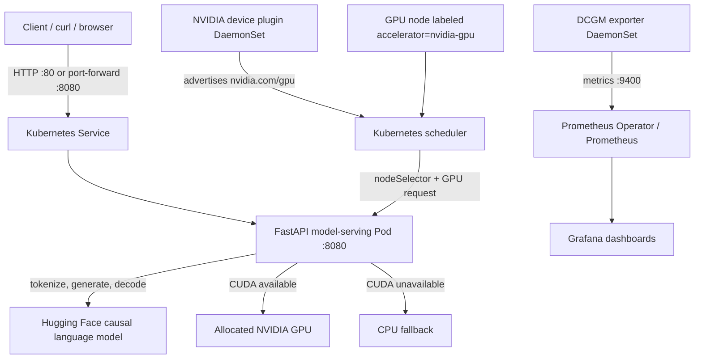

# GPU-Aware Kubernetes Model Serving

A learning project that serves a Hugging Face causal language model through
FastAPI, detects whether CUDA is available, schedules the service onto GPU
nodes in Kubernetes, and exposes NVIDIA GPU metrics for Prometheus.

The same application can run locally on CPU, in Docker, or on a GPU-enabled
Kubernetes cluster. Local CPU mode is useful for checking the API, but it does
not demonstrate GPU scheduling or GPU acceleration.

> **Validation status:** The API has been run and tested locally on CPU.
> GPU inference, Kubernetes GPU scheduling, and DCGM/Prometheus GPU monitoring
> are configured as project goals but have **not yet been tested on a
> GPU-enabled cluster**.

## Contents

- [What this project demonstrates](#what-this-project-demonstrates)
- [Architecture and request workflow](#architecture-and-request-workflow)
- [Repository map](#repository-map)
- [Prerequisites](#prerequisites)
- [Run locally in WSL](#run-locally-in-wsl)
- [Run with Docker](#run-with-docker)
- [API reference](#api-reference)
- [Run automated tests](#run-automated-tests)
- [Load testing](#load-testing)
- [Deploy to Kubernetes with a GPU](#deploy-to-kubernetes-with-a-gpu)
- [Configuration and resource notes](#configuration-and-resource-notes)
- [Troubleshooting](#troubleshooting)
- [License](#license)
- [Limitations and production considerations](#limitations-and-production-considerations)

## What this project demonstrates

Getting a model to run in a notebook is only one part of serving it. This
project illustrates the infrastructure around inference:

1. Kubernetes discovers GPUs through the NVIDIA device plugin.
2. A model-serving pod requests a GPU and is restricted to labeled GPU nodes.
3. FastAPI loads a Hugging Face model on CUDA when available, otherwise on CPU.
4. Health, readiness, and device endpoints expose the service's state.
5. NVIDIA DCGM exporter publishes GPU telemetry for Prometheus to scrape.

## Architecture and request workflow



### Request path

1. A client sends `POST /generate` with a prompt and optional token limit.
2. FastAPI validates the request with Pydantic.
3. The tokenizer converts text to model input tensors on the selected device.
4. PyTorch runs generation and the API returns generated text, device, and
   measured request latency.

### Kubernetes scheduling path

1. A GPU node must have working NVIDIA drivers and be labeled
   `accelerator=nvidia-gpu`.
2. The NVIDIA device plugin advertises `nvidia.com/gpu` to Kubernetes.
3. The deployment's node selector, GPU request, and toleration constrain where
   the pod can run.
4. The app's `/device` response verifies whether PyTorch actually sees CUDA.

The DCGM exporter is separate from the model API. It collects node GPU metrics;
it does not automatically configure Prometheus or Grafana.

## Repository map

```text
.
├── README.md                         Onboarding, runbook, and troubleshooting
├── Dockerfile                        Container build and Uvicorn startup
├── LICENSE                           MIT license
├── .gitignore                        Excludes virtualenvs, caches, and local files
├── .dockerignore                     Keeps local artifacts out of Docker builds
├── requirements-dev.txt             Development/test dependencies
├── .github/
│   └── workflows/
│       └── tests.yml                 Runs unit tests on pushes and pull requests
├── app/
│   ├── server.py                     FastAPI endpoints, model load, generation
│   └── requirements.txt              Pinned Python dependencies
├── k8s/
│   ├── deployment.yaml               GPU Deployment and ClusterIP Service
│   └── nvidia-device-plugin.yaml     NVIDIA GPU device plugin DaemonSet
├── monitoring/
│   └── dcgm-exporter.yaml            DCGM exporter, Service, ServiceMonitor
├── scripts/
│   └── load-test.sh                  Repeated generation request timing
└── tests/
    └── test_server.py                API tests with mocked model and tokenizer
```

## Prerequisites

### For local WSL/Python execution

- WSL 2 with a supported Ubuntu/Linux distribution
- Python compatible with the pinned PyTorch version in
  `app/requirements.txt` (Python 3.10 or 3.11 is a good choice for these pins)
- Several GB of free disk space for PyTorch, dependencies, and model files
- Internet access for package installation and the first model download

The repository pins `torch==2.3.1`. That release does not provide wheels for
Python 3.14, which is why installing the requirements with Python 3.14 fails.
Use a compatible Python interpreter or use Docker. Do not assume that changing
only the PyTorch version is safe; the dependency pins should be tested together.

### For Docker

- Docker Engine, or Docker Desktop with WSL integration enabled
- Enough free space for the image layers, Python packages, and model cache

You do not need a Docker Hub account to build locally or run a public base
image. You need registry authentication only for private images or when pushing
an image to a registry.

### For Kubernetes GPU deployment

- A Kubernetes cluster with at least one NVIDIA GPU node
- NVIDIA drivers/runtime configured on the GPU node
- Permissions to create namespaces and deploy cluster resources
- An image registry accessible to the cluster
- Prometheus Operator installed if you want the supplied `ServiceMonitor` used

A regular CPU-only WSL environment is not a GPU Kubernetes cluster.

## Run locally in WSL

Run commands from the WSL filesystem shell. The Windows project directory is
available under `/mnt/c`:

```bash
cd "/mnt/c/Users/Acer/Downloads/New Profile/gpu-k8s-model-serving"
```

### 1. Install Python virtual-environment support

If creating a virtual environment reports that `ensurepip` or `venv` is
unavailable:

```bash
sudo apt update
sudo apt install -y python3-venv python3-pip
```

### 2. Use a compatible Python and create the environment

Check the interpreter:

```bash
python3 --version
```

If that prints Python 3.14, select a compatible Python 3.10 or 3.11
installation first. The commands below use Python 3.11; replace `python3.11`
with the compatible interpreter available on your machine:

```bash
python3.11 -m venv .venv
source .venv/bin/activate
python -m pip install --upgrade pip
python -m pip install -r app/requirements.txt
```

If `python3.11` is not installed, check whether your WSL distribution provides
it and its matching venv package (often named `python3.11-venv`). If not, use a
trusted Python version manager or use the Docker instructions instead. Do not
continue with an environment that failed partway through installation.

### 3. Start the API

The default model is `distilgpt2`. For more instruction-oriented responses,
the example below selects `HuggingFaceTB/SmolLM2-360M-Instruct`:

```bash
cd app
MODEL_NAME=HuggingFaceTB/SmolLM2-360M-Instruct \
  python -m uvicorn server:app --host 0.0.0.0 --port 8081
```

Keep this terminal open. The model downloads the first time it is loaded.
Startup may take a while, and the model files are cached by Hugging Face for
later runs.

### 4. Check the API from a second WSL terminal

```bash
curl http://localhost:8081/healthz
curl http://localhost:8081/readyz
curl http://localhost:8081/device
```

Generate text:

```bash
curl -X POST http://localhost:8081/generate \
  -H 'Content-Type: application/json' \
  -d '{"prompt":"What is Kubernetes? Answer in one sentence.","max_new_tokens":40}'
```

Interactive API documentation is available at
[`http://localhost:8081/docs`](http://localhost:8081/docs).

To stop the server, return to its terminal and press **Ctrl+C**.

## Run with Docker

Docker avoids installing the project's pinned Python dependencies into your
WSL Python environment. Run these commands from the repository root:

```bash
cd "/mnt/c/Users/Acer/Downloads/New Profile/gpu-k8s-model-serving"
docker version
docker build -t gpu-model-serving:local .
```

The first build downloads the CUDA runtime base image and Python packages, so it
can take time and several GB of disk space. The CUDA base image provides the
container runtime libraries, but it does **not** by itself provide a GPU to a
container. GPU use requires a compatible NVIDIA host/WSL setup and Docker GPU
access.

Start the container, mapping host port `8082` to container port `8080`:

```bash
docker run --rm --name gpu-model-serving \
  -p 8082:8080 \
  -e MODEL_NAME=HuggingFaceTB/SmolLM2-360M-Instruct \
  gpu-model-serving:local
```

Keep this terminal open. In another WSL terminal, use
[`http://localhost:8082/docs`](http://localhost:8082/docs) or:

```bash
curl http://localhost:8082/healthz
curl http://localhost:8082/device
curl -X POST http://localhost:8082/generate \
  -H 'Content-Type: application/json' \
  -d '{"prompt":"What is Kubernetes? Answer in one sentence.","max_new_tokens":40}'
```

The container listens on `0.0.0.0:8080` internally; browse to the host mapping
(`localhost:8082` above), not to `0.0.0.0`.

Stop the container with **Ctrl+C**. `--rm` removes the stopped container, but
keeps the locally built image and the Hugging Face cache stored in the
container's writable layer only while that container exists. To persist model
downloads across runs, mount a cache directory:

```bash
mkdir -p "$HOME/.cache/huggingface"
docker run --rm --name gpu-model-serving \
  -p 8082:8080 \
  -e MODEL_NAME=HuggingFaceTB/SmolLM2-360M-Instruct \
  -e HF_HOME=/cache \
  --user "$(id -u):$(id -g)" \
  -v "$HOME/.cache/huggingface:/cache" \
  gpu-model-serving:local
```

## API reference

| Method | Path | Purpose |
|---|---|---|
| `GET` | `/` | Basic service identity |
| `GET` | `/healthz`, `/health` | Process health and whether a model is loaded |
| `GET` | `/readyz`, `/ready` | Response body reports `ready` or `loading` |
| `GET` | `/device` | PyTorch device, CUDA availability, and GPU name |
| `POST` | `/generate` | Generate text from a prompt |
| `GET` | `/docs` | Interactive Swagger UI |

Example request:

```json
{
  "prompt": "What is Kubernetes?",
  "max_new_tokens": 40
}
```

`prompt` must not be blank. `max_new_tokens` defaults to 50 and must be from 1
through 256. Extra request fields are rejected. A successful response includes
`text`, `device`, and `latency_ms`. If model loading fails when a generation
request is made, the API returns HTTP 503.

## Run automated tests

The tests use Python's built-in `unittest` runner and FastAPI's `TestClient`.
They mock the model, tokenizer, and PyTorch behavior so tests do not download
model weights and do not require PyTorch or a GPU.

Create and activate the virtual environment as described in
[Run locally in WSL](#run-locally-in-wsl), then install the development/test
requirements from the repository root:

```bash
python -m pip install -r requirements-dev.txt
python -m unittest discover -s tests -v
```

The command should report 10 passing tests. The same command runs automatically
on GitHub Actions for pushes and pull requests. It does not test Docker image
building, a real Hugging Face model download, CUDA hardware, or Kubernetes
deployment.

## Load testing

The script sends repeated `POST /generate` requests. If `hey` is installed, it
uses `hey` with concurrency 5. Otherwise it uses a sequential `curl` loop and
prints per-request elapsed time. The fallback is a simple timing loop, not a
full throughput or percentile benchmark.

From the repo root:

```bash
bash scripts/load-test.sh http://localhost:8081/generate 10
```

For a Docker container started with the port mapping above:

```bash
bash scripts/load-test.sh http://localhost:8082/generate 10
```

The optional `hey` tool can be installed separately. Do not interpret CPU and
GPU timings as comparable unless the model, token limit, warm-up, concurrency,
and hardware are held consistent.

## Deploy to Kubernetes with a GPU

This path requires a real GPU-capable Kubernetes cluster. The supplied
deployment manifest has a deliberate image placeholder; replace it with the
image pushed to a registry the cluster can access.

### 1. Build and push the serving image

Choose a registry and image name, then build and push. For example:

```bash
export IMAGE=ghcr.io/<owner>/<repository>/gpu-model-serving:latest
docker build -t "$IMAGE" .
docker login ghcr.io
docker push "$IMAGE"
```

Authenticate to the registry as needed. Update the `image:` value in
`k8s/deployment.yaml` to the exact pushed image. If deploying a private image,
configure an image pull secret in the target namespace.

The Kubernetes manifest sets `MODEL_NAME=distilgpt2`. To use another model,
change the environment variable value in `k8s/deployment.yaml` before applying
it.

### 2. Prepare namespaces and label a GPU node

```bash
kubectl create namespace ml-serving
kubectl create namespace monitoring
kubectl get nodes
kubectl label node <gpu-node-name> accelerator=nvidia-gpu
```

If a namespace already exists, `kubectl create namespace` reports that; you
can continue.

### 3. Install NVIDIA device discovery and deploy the app

```bash
kubectl apply -f k8s/nvidia-device-plugin.yaml
kubectl get pods -n kube-system
kubectl describe node <gpu-node-name>

kubectl apply -f k8s/deployment.yaml
kubectl get pods -n ml-serving -w
```

The GPU node should advertise an `nvidia.com/gpu` resource. The model pod
requests one GPU and will remain Pending if no matching, available GPU node
exists. Once ready, access it through a local port-forward:

```bash
kubectl port-forward -n ml-serving svc/gpu-model-serving 8080:80
```

In another terminal:

```bash
curl http://localhost:8080/healthz
curl http://localhost:8080/device
curl -X POST http://localhost:8080/generate \
  -H 'Content-Type: application/json' \
  -d '{"prompt":"What is Kubernetes? Answer in one sentence.","max_new_tokens":40}'
```

For a GPU-backed pod, `/device` should report `"device":"cuda"`,
`"cuda_available":true`, and a GPU name. A Kubernetes GPU request alone is not
proof that the application is using CUDA; check this response and the exporter
metrics.

### 4. Enable GPU metrics

The supplied monitoring manifest requires a Prometheus Operator CRD for
`ServiceMonitor`. It also uses the label `release: monitoring`, which must
match the Prometheus Operator/Helm release selector in your cluster.

```bash
kubectl apply -f monitoring/dcgm-exporter.yaml
kubectl get pods,svc -n monitoring
kubectl get servicemonitor -n monitoring
```

The exporter serves metrics on port 9400. Configure Prometheus to select this
ServiceMonitor; Grafana dashboards are not included in this repository. The
exporter must be scheduled on GPU nodes and have access to the node's NVIDIA
driver facilities.

### 5. Remove the demo resources

```bash
kubectl delete -f monitoring/dcgm-exporter.yaml
kubectl delete -f k8s/deployment.yaml
kubectl delete -f k8s/nvidia-device-plugin.yaml
```

The device plugin is cluster-wide and may be shared by other workloads. Only
remove it if you installed it for this demo and have confirmed nothing else
depends on it. Namespaces are intentionally not deleted by these commands.

## Configuration and resource notes

| Setting | Default | Description |
|---|---|---|
| `MODEL_NAME` | `distilgpt2` | Hugging Face model ID loaded by the app |
| App port | `8080` | Container/Uvicorn listen port |
| `max_new_tokens` | `50` | Default generation length, request maximum 256 |
| Kubernetes GPU | `1` | GPU requested by the deployment |
| Kubernetes node label | `accelerator=nvidia-gpu` | Nodes eligible for app/exporter pods |

Model files are downloaded from Hugging Face on first use and cached. PyTorch
and CUDA-related wheels can consume several GB of download and disk space.
Check free space with:

```bash
df -h /
du -sh .venv "$HOME/.cache/huggingface" "$HOME/.cache/pip" 2>/dev/null
```

The default `distilgpt2` is a small base language model and may produce
low-quality or irrelevant continuations. The instruction-tuned model used in
the examples is more suitable for basic question-answering demonstrations, but
it still is not a production chat model.

**Readiness probe note:** the current `/readyz` handler returns HTTP 200 both
when its JSON body says `ready` and when it says `loading`. Kubernetes HTTP
readiness probes only check the HTTP status, not the JSON body, so the supplied
probe does not actually keep a loading pod out of Service endpoints. Treat this
manifest as a demo until readiness returns a non-2xx status while the model is
not loaded.

## Troubleshooting

| Symptom | Likely cause | What to do |
|---|---|---|
| `python3 -m venv` says `ensurepip`/`venv` is unavailable | WSL venv package is missing | Run `sudo apt update && sudo apt install -y python3-venv python3-pip`, then recreate the environment. |
| `.venv/bin/activate: No such file or directory` | Virtual environment creation failed | Fix the `venv` error first, then run `python3 -m venv .venv` and `source .venv/bin/activate`. |
| `python: command not found` in WSL | Only `python3` is installed, or the venv is not active | Activate `.venv`; otherwise use `python3`. Verify with `which python` and `python --version`. |
| `No matching distribution found for torch==2.3.1` | Python is too new (for example 3.14) for the pinned PyTorch wheel | Use Python 3.10/3.11 and recreate the venv, or run the Docker image. A failed requirements install also means Uvicorn may not be installed. |
| `No module named uvicorn` | Requirements installation failed or went into a different interpreter | Activate the intended venv and install successfully with `python -m pip install -r app/requirements.txt`; then run `python -m uvicorn ...`. |
| `No space left on device` during pip install or Docker build | WSL filesystem or Docker storage is full | Check `df -h /`; clear pip downloads with `python3 -m pip cache purge`; remove only known-unneeded model/image caches. Retry with enough free space. |
| `/readyz` returns `{"status":"loading"}` but Kubernetes reports the pod Ready | The current readiness handler responds HTTP 200 while loading; Kubernetes probes do not parse the JSON body | For production, change readiness to return HTTP 503 until the model is loaded, then verify the deployment readiness probe. |
| Download of `nvidia-*` wheel is very large | Pip selected a CUDA-enabled PyTorch dependency set | This is expected for some PyTorch distributions. For CPU-only local execution, use a compatible CPU-only PyTorch install. Do not install one `nvidia-cublas` wheel by itself as a substitute for a complete compatible PyTorch installation. |
| `curl: (7) Failed to connect to localhost port ...` | Server/container is stopped, failed to start, or a different port was mapped | Keep the server/container terminal running; use the host port from `-p HOST:CONTAINER`; inspect its startup output. |
| `[Errno 98] ... address already in use` | Another process already listens on that port | Stop the previous server with Ctrl+C, or use another port and update the URL/port mapping consistently. Check with `sudo ss -ltnp 'sport = :8080'`. |
| Browser cannot open `http://0.0.0.0:8080` | `0.0.0.0` is a bind address, not the client URL | Browse to `http://localhost:<published-port>/docs`, such as `http://localhost:8082/docs`. |
| Model output is irrelevant or mostly blank | Base model behavior, model quality, or prompt | Use an instruction-tuned model, provide a clear prompt, and keep expectations appropriate for a small demo model. |
| Model startup is slow | First model download, disk I/O, or CPU-only inference | Wait for model initialization and check `/readyz`; retain the Hugging Face cache between runs. |
| Kubernetes pod is Pending | No GPU resource, unmatched node label, unavailable GPU, or taint | Inspect `kubectl describe pod -n ml-serving <pod>` and `kubectl describe node <node>`. Verify node label, `nvidia.com/gpu` capacity, device plugin, and tolerations. |
| Kubernetes pod has `ImagePullBackOff` | Placeholder/wrong image, private image access, or tag absent | Replace the manifest placeholder with a pushed image and configure an image pull secret if private. |
| `ServiceMonitor` kind not found | Prometheus Operator CRDs are not installed | Install/configure a Prometheus Operator or omit the ServiceMonitor resource. |
| `/device` reports CPU in Docker or Kubernetes | CUDA is unavailable inside the runtime | Verify host GPU drivers, NVIDIA container runtime/plugin, GPU allocation, and the installed PyTorch build. A CUDA base image alone is insufficient. |

### Recreate a broken virtual environment

Only remove the project's own virtual environment directory, not other files:

```bash
cd "/mnt/c/Users/Acer/Downloads/New Profile/gpu-k8s-model-serving"
deactivate 2>/dev/null || true
rm -rf .venv
python3.11 -m venv .venv
source .venv/bin/activate
python -m pip install --upgrade pip
python -m pip install -r app/requirements.txt
```

Replace `python3.11` with the compatible interpreter you have installed.

## Limitations and production considerations

- This is a demonstration, not a production inference service.
- Model loading currently happens during application startup and is retried
  lazily when generation is requested if the initial load did not complete.
- The current API has no authentication, request queue, streaming, or
  concurrency controls.
- The Kubernetes Service is internal (`ClusterIP`); use a port-forward or add
  an ingress/load balancer appropriate for your environment.
- The supplied manifests do not install a Kubernetes cluster, Prometheus,
  Grafana, NVIDIA host drivers, or a container registry.
- Before production, assess model licensing and pin a tested model revision;
  add secrets management, resource sizing, autoscaling, observability,
  availability controls, and appropriate network/security policies.

## License

This project is licensed under the MIT License. See [LICENSE](./LICENSE).
The model weights and third-party dependencies used by the app have their own
licenses and terms; review those separately before redistribution or
commercial use.
